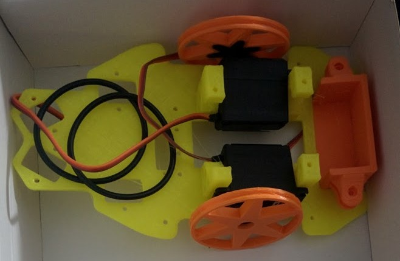
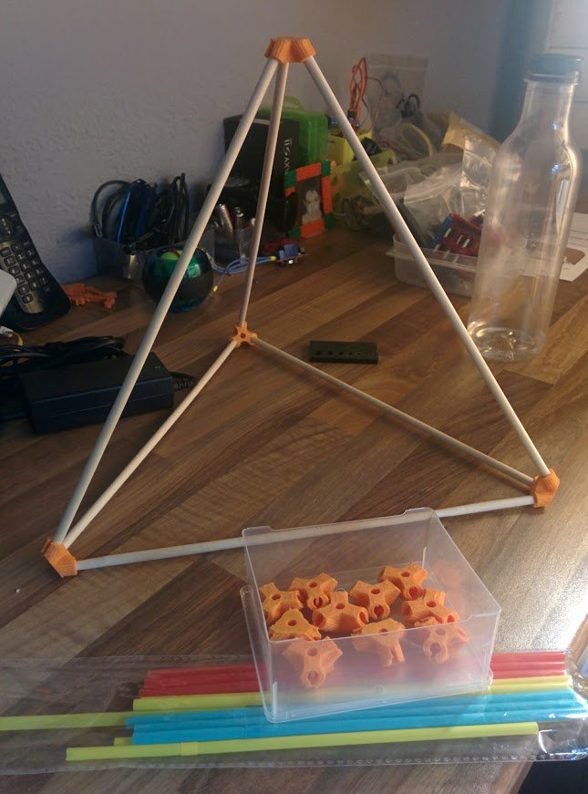
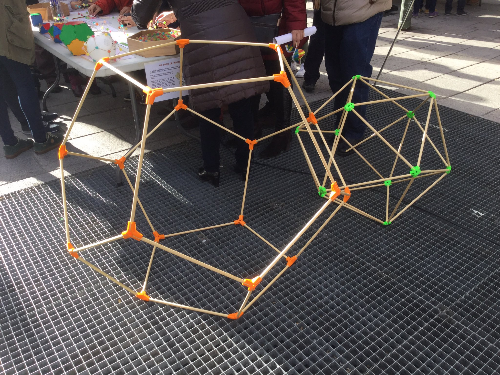

# Charla Csif

La sesión constará de dos partes

* 2 horas: Primera parte programación (a cargo de Pedro Martínez Varo)
* 2 horas: Robótica y Diseño e impresión 3D. Breve ponencia, y luego demostración práctica con la participación del público

## Ponencia (30 minutos)

Continuando con el uso de herramientas de bloques vamos a ver algunas herramientas Open-Source que nos permiten también usando bloques hacer diseños en 3D

[BlockScad](https://www.blockscad3d.com/)

O programar robots, como

[Bitbloq](http://bitbloq.bq.com)

o

[Ardublock](http://blog.ardublock.com)

Para terminar hablaremos también de los nuevos kit de electrónica imprimibles:  bloques modulares al estilo de la programación y que podemos imprimir y montar nosotros mismos

Completaremos la ponencia citando algunas experiencias interesantes de uso de la tecnología en el aula como las de [Diego García](https://unblogfantasticoenguevejar.blogspot.com.es/) y [Eusebio Córdoba](http://tercero.ceipsansebastian.net/)

(Durante la ponencia una impresora 3D está imprimiendo alguna pieza. Dado que es mucho el tiempo que se tarda en imprimir, llevaré todo lo necesario impreso, pero se estará imprimiendo algún componente del kit de electrónica que se use y que termine rápido)

## Parte práctica (90 minutos)

Tendremos 2 actividades: robótica e Impresión 3D

Escogeremos a algún asistente para que haga el montaje

### Robótica (50 minutos)

Utilizaremos un robot con piezas impresas que llevaremos desmontado.

1. Montamos el robot

1. Añadimos la electrónica

1. Programamos un comportamiento sencillo con Bitlboq

### Impresión 3D en el aula (30 minutos)

Montaremos unos poliedros con los vértices impresos y varillas

Llevaremos más piezas impresas para mostrar las posibilidades

